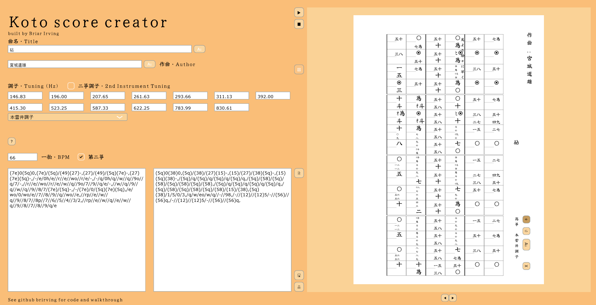
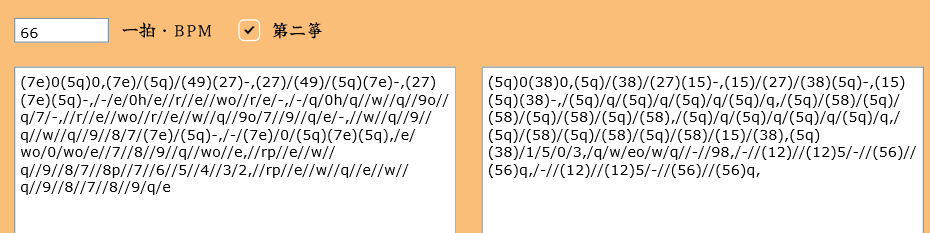
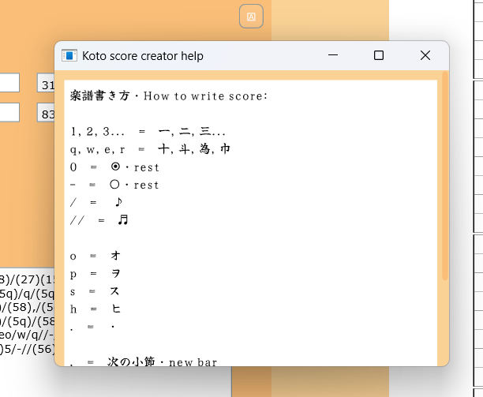
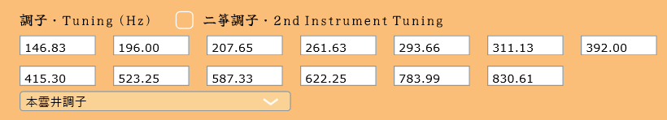
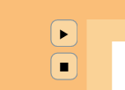
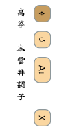
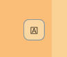
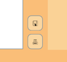

# Koto score creator
#### By Briar Irving

This software has been designed to allow users to write score for koto using a fast, easy to learn 
text entry system. With this program you can:

### Type in any score you'd like:

Type into the score input box in the bottom left of the screen to create a detailed score. 
You can change note lengths, add ornaments, chords, and write for the left hand.

Use the "?"  button to bring up the help window which explains which keyboard inputs create which notations.

### Adjust the tuning to common 調子 using presets, or input your own custom tunings for each string using Hertz values:

By selecting a preset from the dropdown menu, you can set the tuning for your playback to any of the common 調子. If you'd like 
to use a custom tuning, simply enter the desired frequency value in Hertz into the corresponding input box for each string.

### Compose for two koto:

By selecting the "第二箏" tick box, you can add a second koto to your score. The tuning for this second koto can be adjusted separately 
by selecting the "二箏調子・2nd Instrument Tuning" tick box and editing it in the same way as the first koto. You can 
easily switch between without losing any tuning information.

### Playback your score to hear what it sounds like:

By pressing the "▶" button, you can hear what you composition might sound like when played. 

### Write your own notes on tuning and expression:
 

Using the free text button, you can add any text you like to the score, anywhere you like. Once created, 
your text can be moved anywhere on the score, rotated, and set to write vertically.

### Save, load and print your creations:

While writing a score, you can save it to come back to later, and then load it back in when you're ready. And once 
you're finished, you can save it as a pdf using the print button, ready to be printed out and played.

## Have fun composing!

This project is licensed under the MPL 2.0 license.